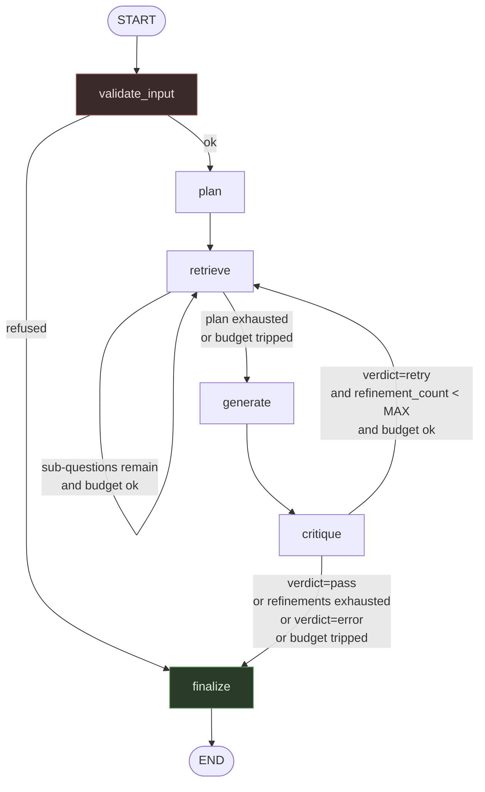

# MIGRATION MAP — v2.1 → v3 (LangGraph)

Companion to [`AUDIT.md`](./AUDIT.md). Section references like *(AUDIT §4.11)* point there.

Nothing in this document has been implemented. It is the plan Phase 1 will be held to.

---

## 1. Concept mapping

### 1.1 Orchestration

| v2.1 | v3 | Note |
|---|---|---|
| `ReActAgent.run(query, …)` | `graph.ainvoke(initial_state, config={"configurable": {"thread_id": …}, "recursion_limit": 25})` | Agent object becomes stateless; all request scope moves into state (fixes AUDIT §4.14) |
| `for step_num in range(max_steps)` (`react_agent.py:304`) | `StateGraph` nodes + conditional edges | The loop stops being a loop |
| `for sub_q in sub_questions` (`react_agent.py:170`) | `retrieve → retrieve` self-edge driven by `plan_cursor` | Sequential, matching v2.1 semantics — see §5.4 for why not `Send` fan-out |
| Critic corrective loop (`react_agent.py:196-202`) | `critique → retrieve` conditional edge, bounded by `refinement_count` | Reuses the same retrieve node instead of a second `_react_loop(max_steps=3)` |
| `_build_loop_hint`, `_normalise_query`, `_extract_top_result_title`, `used_queries`, `consecutive_same` | **Deleted.** Replaced by `recursion_limit` + `refinement_count` + `max_tool_calls` | ~90 lines of prompt-nagging replaced by structural bounds |
| `AGENT_MAX_STEPS = 8` | `MAX_REFINEMENTS` (state counter) + `recursion_limit=25` (graph backstop) | Counters are the intended bound; `recursion_limit` raises `GraphRecursionError` — loud, per the Phase 1 requirement |
| `step_callback(step_num, thought, action, input)` (`react_agent.py:321`) | `graph.astream_events(…, version="v2")` | Survives the HTTP boundary as SSE in Phase 5 |
| `AgentResponse` dataclass | `QueryResponse` Pydantic v2 model in `src/api/schemas.py` | |

### 1.2 Tools

| v2.1 | v3 |
|---|---|
| `Tool` dataclass wrapping `Callable[[str], str]` (`tools.py:18-23`) | LangChain `@tool` with an explicit Pydantic `args_schema` |
| `compare_papers` pipe-delimited args `"A \| B \| aspect"` (`tools.py:104`) | `CompareArgs(topic_a: str, topic_b: str, aspect: str = "comparison")` |
| `self._tools.get(action)` dict lookup + `"[Unknown tool: …]"` string (`react_agent.py:353-355`) | `ToolNode` with a bound tool list; unknown tools are structurally impossible |
| Tool returns a display string that is also the machine-readable result | Tool returns a typed result; formatting for the prompt happens in one place at the end (fixes AUDIT §4.19) |
| `finish` pseudo-tool (`tools.py:247`) | Not a tool. It is the `finalize` node. |
| `trace_bibliography` | Dropped → `docs/BACKLOG.md` (AUDIT §3.3) |
| Blocking `time.sleep` in tools (`tools.py:85`) | `async def` tools with `asyncio.sleep` + explicit `httpx` timeouts (fixes AUDIT §4.10, §4.9) |

### 1.3 Structured LLM output

| v2.1 | v3 |
|---|---|
| `QueryPlanner.plan` → regex-strip fences → `json.loads` → `except: return [query]` (`planner.py:47-56`) | `plan` node: `llm.with_structured_output(Plan)`, 2 bounded repair attempts, failure recorded as a `GuardrailEvent` and degraded to single-hop **visibly** (fixes AUDIT §4.4) |
| `AnswerCritic.evaluate` → same pattern → `except: return pass` (`critic.py:74-91`) | `critique` node: `with_structured_output(Critique)`; on parse failure the verdict becomes `error`, not `pass`, and routes to `finalize` with a flag (fixes AUDIT §4.3) |
| `_parse` regex fallback (`react_agent.py:506-520`) | Deleted — nothing emits free-form JSON any more |

### 1.4 Memory and persistence — *the honest justification for the rewrite*

| v2.1 | v3 |
|---|---|
| `ConversationMemory` — in-process list, `format_for_prompt` truncates each turn to 300 chars (`memory.py:39-46`) | `messages: Annotated[list[AnyMessage], add_messages]` |
| `ProjectManager.conversations` + `messages` tables, 911 lines, 7 tables (`project_manager.py`) | `SqliteSaver` checkpointer |
| `ResearchMemory` JSON notes | Dropped (AUDIT §3.3) |
| `MemoryConsolidator` | Dropped → `docs/BACKLOG.md` |

The distinction worth being precise about in an interview: v2.1 persists **completed
turns**. If a run dies at sub-question 3 of 4, everything is lost and the next attempt
starts from zero. `SqliteSaver` persists **graph state after every node**, so a run resumes
mid-flight, and `interrupt()` becomes possible at all. That is a capability v2.1 does not
have, not a reimplementation of one it does.

### 1.5 Retrieval — ported, not rewritten

| v2.1 | v3 | Change |
|---|---|---|
| `processing/chunker.py` | `src/retrieval/chunker.py` | None (see §5.8 for the `section_type` caveat) |
| `retrieval/embeddings.py` | `src/retrieval/embeddings.py` | None in Phase 1; `bge-small` comparison is Phase 5 |
| `retrieval/vector_store.py` | `src/retrieval/vector_store.py` | None, except documenting the 200-candidate ceiling (AUDIT §4.16) |
| `retrieval/dense.py`, `bm25.py` | `src/retrieval/dense.py`, `bm25.py` | None |
| `sources/source_router.py` | `src/retrieval/router.py` | Drop the dead `section_type` branch |
| `sources/arxiv_fetcher.py` | `src/retrieval/arxiv.py` | Async + explicit timeouts |
| `sources/session_index.py` | `src/retrieval/session_index.py` | Fix caller-dict mutation (§4.17); batch the disk write (§4.18) |

Phase 1 must not touch embedding model, chunk size, `IndexFlatIP`, BM25 tokenisation, or
the merge/dedupe rule. Any of those invalidates the v2.1↔v3 comparison.

### 1.6 Guardrails and observability

| v2.1 | v3 |
|---|---|
| `_is_in_scope` keyword fast-path + LLM, fails **open** (`react_agent.py:236-258`) | `src/guardrails/scope.py`, fails **closed** with a fixed refusal message, emits a `GuardrailEvent` |
| Retrieved text spliced raw into prompts (AUDIT §4.11) | `src/guardrails/injection.py`: delimited data blocks, data-not-instruction framing, imperative-pattern detector, every detection logged to the trace |
| `Generator._RateLimiter`, used by nothing the agent calls (AUDIT §4.8) | `src/guardrails/budget.py`: token cap, cost cap, wall-clock deadline, tool-call cap — enforced in every routing function |
| `logging` to stdout | Langfuse callback handler + OTel spans around retrieval/embedding |
| `tests/run_evaluation.py`, 3 hardcoded questions | `evals/` — versioned JSONL + checksum, runner, committed baseline, CI regression gate |

---

## 2. `AgentState` — field by field

### 2.1 Recommended container: `TypedDict`, not a Pydantic state model

The Phase 1 brief allows either. Recommendation is `TypedDict` for the state container,
with every non-scalar **value** being a Pydantic v2 model, because:

- LangGraph nodes return *partial* updates (`{"answer": …}`). A Pydantic state model has to
  be revalidated in full on every partial merge, which turns a 5,000-token `retrieved` list
  into a per-node revalidation cost for no benefit.
- `add_messages` and custom reducers are declared via `Annotated[...]` on `TypedDict` keys;
  that is the path with the most support and the fewest sharp edges.
- Validation is still enforced at the two boundaries that matter — the API request/response
  schemas and the `with_structured_output` calls — which is where untrusted data actually
  enters.

### 2.2 Fields

`LWW` = last-write-wins (LangGraph's default when no reducer is annotated).

| Field | Type | Reducer | Why this reducer |
|---|---|---|---|
| `thread_id` | `str` | LWW | Set once at entry, never rewritten. Correlates the checkpoint, the Langfuse session, and the API response. |
| `question` | `str` | LWW | Immutable after `validate_input` by convention. A reducer would imply it changes; it does not. |
| `request` | `RequestOptions` | LWW | `allowed_paper_ids`, `use_arxiv`, `top_k`, `prompt_version`. **This field is the fix for AUDIT §4.14** — the four attributes v2.1 mutated on the shared agent object become checkpointed per-request state. LWW because exactly one writer (entry) sets it. |
| `messages` | `list[AnyMessage]` | **`add_messages`** | Not `operator.add`. `add_messages` dedupes and *updates* by message id, which is what makes checkpoint resume idempotent — replaying a node after a crash must not append a duplicate assistant turn. `operator.add` would double every message on resume. |
| `plan` | `list[SubQuestion]` | LWW | Written by `plan` initially and by `critique` when it appends refinement hints. Both writers do a whole-list read-modify-write and never run concurrently, so LWW is correct. `operator.add` would silently double the plan if a checkpoint replayed the `plan` node. |
| `plan_cursor` | `int` | LWW | A **position**, not a tally. Under `operator.add` a replayed node would advance the cursor twice and skip a sub-question. |
| `retrieved` | `list[RetrievedChunk]` | **custom: `merge_retrieved`** | Not `operator.add`. The refinement loop re-enters `retrieve` and re-surfaces overlapping chunks; plain concatenation would inflate the generation prompt, the token bill, and the Recall@k denominator in the eval. `merge_retrieved` appends, dedupes on `chunk_id` keeping the max score, and preserves first-seen order so provenance stays stable. |
| `retrieval_events` | `list[RetrievalEvent]` | `operator.add` | Append-only audit log: `(query, route, k, latency_ms, hit_chunk_ids, retriever)`. Duplicates are *meaningful* here — two identical retrievals are two real events, and collapsing them would hide the loop the eval is trying to measure. This is what OTel spans in Phase 3 attach to. |
| `tool_calls` | `list[ToolCallRecord]` | `operator.add` | Append-only. Replaces v2.1's `scratchpad: list[Step]`. Carries `(name, args, ok, error, latency_ms, cost_usd)` as structured data, so the budget guard can count against it and Langfuse can render it without regex. |
| `draft_answer` | `str \| None` | LWW | Deliberately overwritten each refinement round. The version history lives in `messages`; keeping both would be two sources of truth. |
| `critique` | `Critique \| None` | LWW | Only the latest verdict routes. Prior verdicts are already in `messages` and the trace. |
| `refinement_count` | `int` | **LWW, incremented node-side** | Explicitly *not* `operator.add`. This counter is a safety bound. Under `operator.add`, an accidental double-write — a node retry, a replayed checkpoint — inflates it and terminates a healthy run early. A guard that fires spuriously is as bad as one that never fires. Read-modify-write in the single node that owns it (`critique`) keeps it auditable. Safe only because no fan-out touches it; if §5.4 fan-out is ever adopted this must be revisited. |
| `guardrail_events` | `list[GuardrailEvent]` | `operator.add` | Append-only, one per detection: `(kind, severity, detail, node, chunk_id?)`. Phase 2 requires every detection to reach the trace, so nothing may be collapsed or overwritten. |
| `refused` / `refusal_reason` | `bool` / `str \| None` | LWW | Terminal decision from `validate_input`. |
| `usage` | `Usage` | **custom: `merge_usage`** | Neither default works. LWW drops every node's spend except the last; `operator.add` is undefined for a model. `merge_usage` sums `input_tokens`, `output_tokens`, `cost_usd`, `llm_calls`, `tool_calls`, and takes `min` of `deadline_at`. Each node returns only its own delta, which keeps nodes independent and makes per-node cost attribution (Phase 3's deliverable) fall out for free. |
| `truncated` / `truncation_reason` | `bool` / `str \| None` | LWW | Set when a budget ceiling trips. Phase 2 requires this to be explicit in the response body, never a silent stop. |
| `answer` | `str \| None` | LWW | Terminal. Written only by `finalize`. |
| `sources` | `list[Source]` | LWW | **Derived**, not accumulated — `finalize` projects it from `retrieved`. This is the direct fix for AUDIT §4.19: sources stop being reconstructed by regex from display strings, so they can no longer silently vanish when a tool's output format changes. |

### 2.3 Sketch

```python
class AgentState(TypedDict):
    thread_id: str
    question: str
    request: RequestOptions

    messages: Annotated[list[AnyMessage], add_messages]

    plan: list[SubQuestion]
    plan_cursor: int

    retrieved: Annotated[list[RetrievedChunk], merge_retrieved]
    retrieval_events: Annotated[list[RetrievalEvent], operator.add]
    tool_calls: Annotated[list[ToolCallRecord], operator.add]

    draft_answer: str | None
    critique: Critique | None
    refinement_count: int

    guardrail_events: Annotated[list[GuardrailEvent], operator.add]
    refused: bool
    refusal_reason: str | None

    usage: Annotated[Usage, merge_usage]
    truncated: bool
    truncation_reason: str | None

    answer: str | None
    sources: list[Source]
```

Every capitalised type above is a Pydantic v2 model in `src/agent/state.py`.

---

## 3. Nodes

| Node | Reads | Writes | LLM calls |
|---|---|---|---|
| `validate_input` | `question` | `refused`, `refusal_reason`, `guardrail_events`, `messages` | 0–1 (scope classifier, keyword fast-path first) |
| `plan` | `question` | `plan`, `plan_cursor`, `usage`, `messages` | 1 (`with_structured_output(Plan)`) |
| `retrieve` | `plan`, `plan_cursor`, `request` | `retrieved`, `retrieval_events`, `tool_calls`, `guardrail_events`, `plan_cursor`, `usage` | 0 normally; 1+ only when a live-fetch tool is selected |
| `generate` | `question`, `retrieved`, `messages` | `draft_answer`, `messages`, `usage` | 1 |
| `critique` | `question`, `draft_answer`, `retrieved` | `critique`, `refinement_count`, `plan`, `plan_cursor`, `usage` | 1 (`with_structured_output(Critique)`) |
| `finalize` | everything | `answer`, `sources`, `truncated`, `truncation_reason`, `messages` | 0 |

Worst-case LLM calls per request: 1 + 1 + 4·(0..1) + 1 + 1 + 2·(2 + 1 + 1) = **~16**,
against v2.1's ~43 (AUDIT §4.7) — and unlike v2.1 there is a hard cost ceiling underneath
it. This is a claim Phase 4 must measure, not assume; it is written here so the eval can
falsify it.

---

## 4. Graph topology



Three conditional edges, each of which consults the budget guard:

| Router | Returns |
|---|---|
| `route_after_validate` | `"finalize"` if `refused` else `"plan"` |
| `route_after_retrieve` | `"retrieve"` if `plan_cursor < len(plan)` and `budget_ok(state)` else `"generate"` |
| `route_after_critique` | `"retrieve"` if `critique.verdict == "retry"` and `refinement_count < MAX_REFINEMENTS` and `budget_ok(state)` else `"finalize"` |

`budget_ok` checks all four ceilings (tokens, cost, wall-clock, tool calls). When it
returns `False` the router sets `truncated=True` with a reason and routes to `finalize`,
so the caller always receives a partial answer with an explicit flag rather than a silent
stop — the Phase 2 requirement.

**Recursion limit.** Longest legal path: `validate`(1) + `plan`(1) + `retrieve`(4) +
`generate`(1) + `critique`(1) + 2 × [`retrieve`(2) + `generate`(1) + `critique`(1)] +
`finalize`(1) = 17 steps. Compile with `recursion_limit=25`. The counters are the intended
bound; `recursion_limit` is the backstop that raises `GraphRecursionError` loudly if a
counter is ever wrong. Phase 1's termination test must assert both bounds independently.

`finalize` is deliberately reachable from `validate_input` so that refusals, truncations,
and successes all leave through one exit and produce one response shape.

---

## 5. Where a direct port would be a bad idea

### 5.1 Do not port the ReAct free-tool-choice loop

**v2.1:** the model emits `{"thought","action","action_input"}` and a dict lookup dispatches
it (AUDIT §2.2). Roughly 40% of `react_agent.py` exists to stop that loop misbehaving.

**Why it is a bad port:** free tool choice is what makes the loop unbounded, and every
guard in v2.1 is a *prompt-level* mitigation for a *structural* problem — telling the model
"⚠ You are looping" and hoping. It also makes cost unpredictable and traces hard to read,
because the same node appears N times with no semantic difference between iterations.

**Recommended alternative:** a fixed `plan → retrieve → generate → critique` skeleton where
retrieval *strategy* (dense / sparse / live-arXiv) is a routing decision inside the
`retrieve` node, not a free LLM choice. Keep `fetch_arxiv` and `compare_papers` as genuine
bound `@tool`s with Pydantic schemas, invoked from `retrieve` under a `max_tool_calls`
ceiling. The loop guard is then not "improved" — it is deleted, because the thing it was
guarding no longer exists.

### 5.2 Do not port `_extract_sources`

Reconstructing provenance by regex over formatted display strings (AUDIT §4.19) is broken
today — three of the six tools produce output the regex cannot match, so those answers
report zero sources. Carry `RetrievedChunk` objects in `retrieved` and project `sources` in
`finalize`. Format for the prompt at the last possible moment.

### 5.3 Do not port `_wrap_citations`' fuzzy matching

Bidirectional substring matching (AUDIT §4.20) links citations to the wrong paper whenever
one title is a substring of another. Have `generate` cite `[chunk_id]` markers drawn from
the delimited context blocks it was given, and resolve those to exact `paper_id`s in
`finalize`. This also makes faithfulness measurable in Phase 4, because the claim→chunk
mapping is explicit rather than inferred.

### 5.4 Do not use `Send` fan-out for sub-questions in Phase 1 — even though it would demo well

`Send`-based map-reduce over sub-questions is the flashier LangGraph feature and it fits:
sub-question retrievals are independent, and `retrieved`/`retrieval_events` already have
concatenating reducers that would tolerate it.

**Recommendation: don't, in Phase 1.** Parallelising changes the latency and cost profile
against which v2.1 is being compared, so it would land in the same commit as the baseline
it is meant to be measured against. It also breaks the `refinement_count` reducer choice in
§2.2. Ship the sequential self-edge, establish the baseline in Phase 4, *then* run fan-out
as a Phase 6 variant experiment where the latency delta can be reported as a measured
number instead of an assertion. Logged in `docs/BACKLOG.md`.

### 5.5 Invert the fail-open guards rather than porting them

`_is_in_scope` returning `True` on exception (AUDIT §4.2) and `AnswerCritic` returning
`pass` on exception (AUDIT §4.3) are both defaults that turn a broken component into an
invisible one. In v3: scope failure → refuse + `GuardrailEvent`; critique parse failure →
`verdict="error"` (which routes to `finalize`, not to a refinement round) + a flag on the
response. Neither may ever be reported as a clean pass.

### 5.6 Do not port `time.sleep`-based politeness

`tools.py:85` and `arxiv_fetcher.py:57` block (AUDIT §4.10). Under `astream_events` in an
async FastAPI worker this stalls the event loop and every concurrent request with it. Make
the arXiv tools `async`, use `asyncio.sleep` for arXiv's rate policy, and put an explicit
timeout on every outbound call — v2.1 has none on Gemini at all (AUDIT §4.9).

### 5.7 Port the pickle-loaded index, but write down that it is a trust boundary

`vector_store.py:67` and `embeddings.py:80` both `pickle.load` (AUDIT §4.12). Rebuilding
the index in a different format in Phase 1 would change the artifact the whole comparison
rests on, so: **port as-is**, and state explicitly in the README and the Dockerfile that
the FAISS index and its `_meta.pkl` are trusted build artifacts produced by `make index`,
never fetched at runtime from anywhere else. A non-pickle sidecar (JSONL or parquet chunk
store) goes in `docs/BACKLOG.md` as a Phase 5+ hardening item, to be done at a point where
the index can be rebuilt and re-baselined together.

### 5.8 `section_type`: make it real or drop it — do not port it as it stands

AUDIT §4.15: the field is never passed by any caller, and the shipped chunk cache does not
contain it, so the "structural RAG" feature is dead code sitting on top of data that could
not support it anyway.

Three options, in order of preference:

1. **Classify at load time.** `classify_section` is deterministic and text-only, so
   recomputing it when chunks are loaded repopulates the field on the existing 5,401 chunks
   **without re-embedding anything**. The FAISS index stays bit-identical, the comparison
   stays valid, and the feature becomes real and measurable — Phase 4 can then report
   whether section filtering helps or hurts, which is a far better story than either
   shipping it unmeasured or quietly deleting it.
2. Drop the field entirely and say so.
3. Re-chunk and re-embed — **rejected**: invalidates the index and the v2.1 comparison for
   a feature whose value is unmeasured.

Recommendation: option 1, with the classifier's own precision noted as unvalidated
(it is an ordered substring match over the first 600 characters; "in the abstract" inside a
methodology chunk classifies as `abstract`).

### 5.9 Do not port `AGENT_MAX_STEPS` as the cost control

Step counts are a proxy for spend, and a bad one — v2.1's prompt grows with the scratchpad
(AUDIT §4.7), so step 8 costs several times step 1. v3's ceilings must be denominated in
the units that actually matter: input tokens, output tokens, USD, wall-clock seconds, and
tool calls. Step count stays only as the `recursion_limit` backstop.

---

## 6. Open questions

These need your decision. None of them block Phase 1 — the recommended default is stated
for each, and Phase 1 will proceed on it unless you say otherwise.

**Q1 — The benchmark (blocks Phase 4, not Phase 1).**
The 100-pair QA set is recoverable from v2.1 git history but has **zero overlap** with the
shipped corpus (AUDIT §5.2), so "port the 100-pair QA benchmark" is not executable as
written. Options: **(a)** regenerate ~100 pairs against the current 150-paper corpus, LLM-
drafted with a manually verified slice, and retire the v2.1 README numbers as
unreproducible; **(b)** re-collect the original `2604.*` corpus so the existing set applies;
**(c)** both, reported separately.
*Recommendation: (a).* (b) means downloading a second 150-paper corpus to validate numbers
that were never reproducible anyway, and the harder multi-hop + unanswerable sets Phase 4
requires have to be written from scratch regardless.

**Q2 — Generation model.** v2.1 uses Gemini 2.5 Flash Lite throughout.
*Recommendation: keep it* for the agent, so v2.1↔v3 differences are attributable to
orchestration rather than to a model swap. LangChain's `init_chat_model` makes the provider
a config value, so this is reversible in one line.

**Q3 — Judge model (blocks Phase 4).** v2.1 judges Gemini output with Gemini
(`run_evaluation.py:59`), which is self-preference bias by construction.
*Recommendation:* judge with a different model family than the generator, and validate the
judge against a human-labelled slice of ~20 items as Phase 4 requires. Needs a second API
key — tell me which provider you have.

**Q4 — How the corpus crosses repos.** v3 needs `metadata.json` (268 KB),
`chunks_512.json` (16 MB), and `results/indices/BGE_cs512.{faiss,pkl}` (37 MB). Options:
**(a)** commit chunks + metadata, rebuild the index via `make index`; **(b)** commit the
prebuilt index too (~53 MB total — under GitHub's 100 MB hard limit, over its 50 MB
warning); **(c)** Git LFS; **(d)** keep artifacts out of git and document a `make fetch`.
*Recommendation: (a)* — reproducible, keeps the repo clonable, and `make index` is a target
Phase 5 needs anyway for the Docker build. The 150 source PDFs (561 MB) stay out of git
under every option.

**Q5 — Repository layout.** The brief's tree is rooted at `arxiv-agent-v3/`; this repo is
`langgraph-research-agent`. *Assumption:* the tree goes at the repo root (`src/`, `evals/`,
`tests/`, `docs/`, `infra/`, `.github/`), no nested `arxiv-agent-v3/` directory. Say so if
you want it nested.

**Q6 — Python version.** The brief says 3.11+; this machine has 3.13.7, and `faiss-cpu`
and `torch` wheel availability on 3.13 is the usual friction point.
*Recommendation:* pin the project to **3.11** via `uv`/`pyenv` and target 3.11 in CI, so
the Dockerfile and local dev match and the v2.1 dependency set installs cleanly.

**Q7 — Langfuse.** Phase 3 requires self-hosting via `docker compose`. Docker 29.2.0 is
installed and on PATH, so this should work locally; Langfuse Cloud will be documented as
the alternative for the deployed instance. No action needed unless you object.
